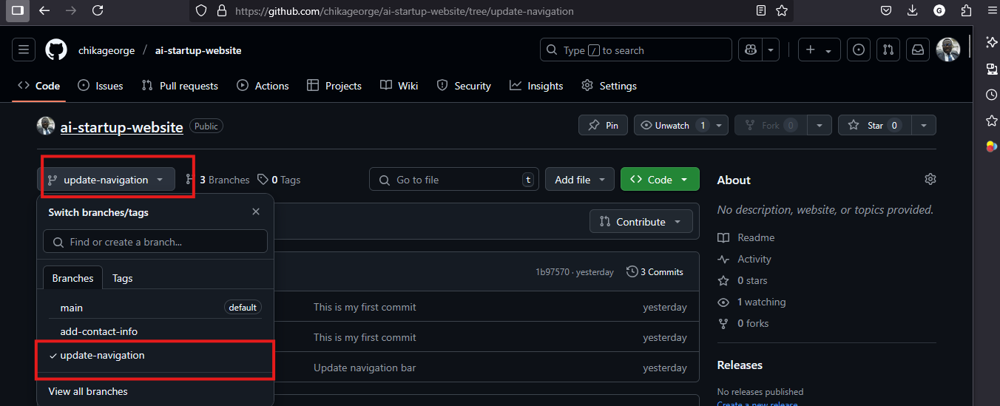
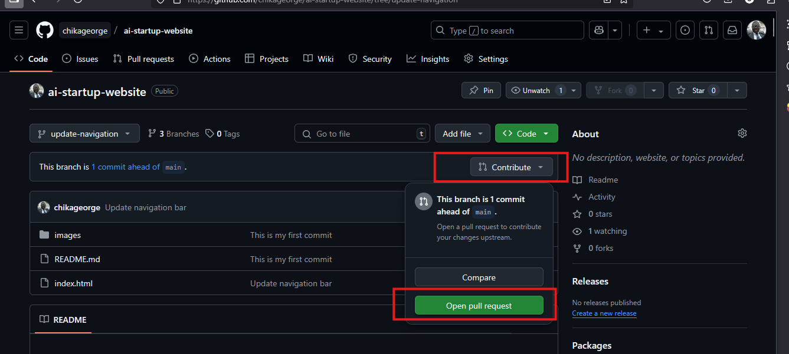
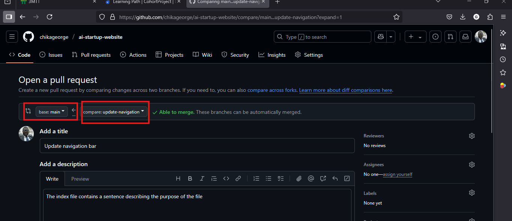
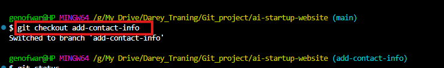
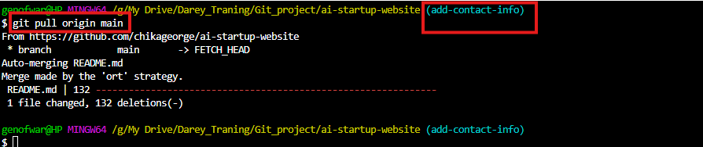
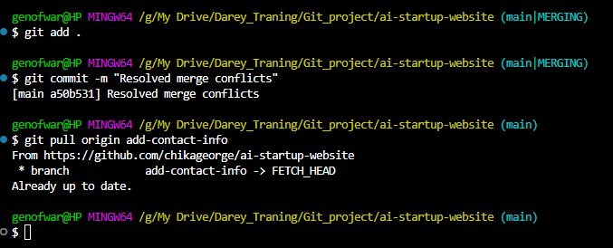

## Part 3: Merging Changes

### Steps:
1. **Switch to Update-navigation branch**:
   

2. **Create New Pull Request**
   

   

---
## Updating Jerry's Branch with latest changes

### Steps:
1. **Switch to Jerry's Branch**:
   ```bash
   git checkout add-contact-info
   ```
    
2. **Pull the changes from the main branch**
    ```bash
   git pull origin main
   ```
   

    
---
## Finalizing Jerry's Contribution

### Steps:
1. **Push the updated version to giihub**:
   ```bash
   git push origin add-contact-info
   ```
   
---
